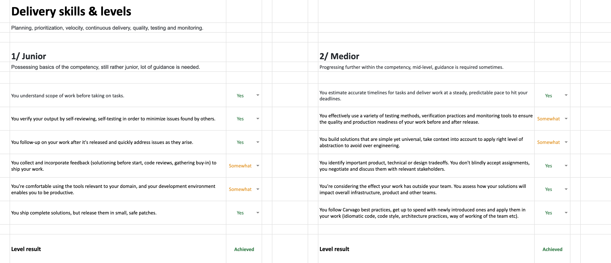

# Competency Assessment

The biggest part of preparation for a [performance review meeting](performance-review.md) is competency assessment, make sure you reserve at least 2 hours for that. Results of the assessment are used as input to discussion with your manager. Make sure to ask your colleagues for feedback in advance before doing the competency assessment.

## First-time Self Assessment

We use Excel sheet to track your competencies and score. Every person should have their own private copy so that nothing leaks out. Check the [competency overview](score.md#competencies) to learn more about details of the competencies.

1. **Download** the [assessment template document](#assessment-template-documents) and store it to your Google Drive.
1. **Assess** your skills (Nope, Somewhat or Yes) for every competency (sheet) and every level (column). Level achievement is calculated automatically, do not fill it in.
1. **Share** the document with your manager so that they can see your scores, comments, comment on their own etc.

## Follow-up Self Assessment

If you have already done the first-time self-assessment some time in the past, you have the document from last time. If you think there was a change in one of your skills, highlight it with a different background color and **insert a comment** describing the proposal and specific demonstrations that prove the change. Do **not update the score directly**, as this is supposed to be a discussion with your manager on your progress.

## Grace Period

While our career framework works very well for more seasoned employees, recent hires might still need more time and opportunities to demonstrate all expected competencies during the first few months. And therefore we grant each new hire a **grace period to demonstrate progress towards desired competencies**. The grace period might take up to **ten months**.

## Assessment Template Documents

Every career track has it's own template document.

- [Frontend Engineer Assessment Template](assets/frontend-assessment-template.xlsx)
