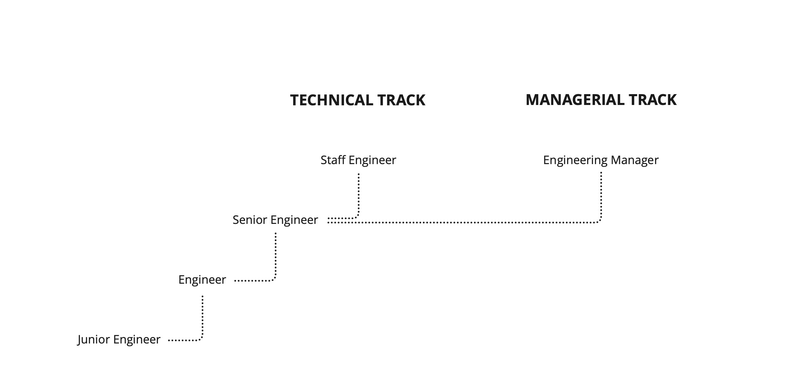

    

# Announcement

This is still a work in progress. We are currently working on the first version of this career framework and will be rolling it out soon 👷‍♂️

# Motivation

Our mission at Carvago is not only to deliver exceptional products to others, we also want to establish a great environment inside the company where people can grow professionally and personally.

To support such growth, we implemented this career framework. It defines competencies for specific career tracks, which helps our employees understand where they are in their careers and where they can advance if they choose to.

# How it works

Our career framework is built bottom-up, which means it starts with very specific low-level skills which you can acquire. Having those skills advances you in different [competencies](competencies.md) where you level-up when you acquire new skills. Those competencies and levels reached there determine your overall career [progress](progress.md) within your [career track](#career-tracks). The career track is quite specific already and together with the progress, it determines your [job title](#tracks-and-job-titles), salary bounds, [compensation](compensation.md) and also responsibilities.

In order to determine all of this and **ensure that everyone progresses forward**, we do [performance reviews](performance-reviews/readme.md) every six months. During a performance review, your manager will hold a general career discussion with you, you will [assess your competencies](performance-reviews/competency-assessment.md) with the manager and talk about your successes, failures and opportunities for improvement. To make sure we dedicate enough attention continuously to your [personal goals](performance-catchups/personal-goals.md), there are also periodic [performance catchups](performance-catchups/readme.md) where your manager will check up on your goals and help you in any way possible to **achieve the goals**. If you complete some of your goals, this is the event where new goals will be established.

# Career Ladder

There are multiple different roles and **career tracks** you can pursue, the main distinction is into individual contributor and technical or managerial tracks. The main difference obviously is that a manager manages people which by default increases their responsibility. However this does not mean, that in order to progress in your career, you need to become a manager. This is a choice and an **expert individual contributor is as valuable as a senior manager**. We try to reflect this in the compensation as well. Among individual contributor career tracks, you are able to switch pretty much freely. In order to get to one of the management or leadership career tracks, you need to be assigned that role, you cannot choose this on your own :)

Everybody in the tech team has a career track which impacts several things. Your career track defines which competencies you should focus on, which skills and goals are important for your development and what are your **responsibilities** (defined on detail page of each career track). It also defines what should be your minimal compensation based on your progress. Or vice versa, based on your competencies, you might discover which career track is the most fitting for you.

# Career Tracks

Individual career tracks define the responsibilities and competencies you should possess in order to be successful in your role. They also define the salary bounds for each job title. The career tracks are:

- [Product Division Lead](career-tracks/product-division-lead.md) - VP Engineering
- [Platform Division Lead](career-tracks/platform-division-lead.md) - VP Engineering
- [Product Family Lead](career-tracks/product-family-lead.md) - Director of Engineering
- [Platform Family Lead](career-tracks/platform-family-lead.md) - Director of Engineering
- [Product Team Lead](career-tracks/product-team-lead.md) - Enginnering Manager
- [Platform Team Lead](career-tracks/platform-team-lead.md) - Enginnering Manager
- [Technical Leader](career-tracks/technical-leader.md) - Staff / Principal Enginner
- [Engineer](career-tracks/engineer.md) - Junior / Senior Enginner

# Contents

- [Competencies](competencies.md)
- [Progress](progress.md)
- [Compensation](compensation.md)
- [Calendar](calendar.md)
- [Performance Reviews](performance-reviews/readme.md)
  - [Competency Assessment](performance-reviews/competency-assessment.md)
  - [Performance Review Meeting](performance-reviews/performance-review-meeting.md)
  - [Managers](performance-reviews/managers/readme.md)
    - [Training](performance-reviews/managers/training.md)
    - [Calibration](performance-reviews/managers/calibration.md)
  - [Retrospective](performance-reviews/managers/retrospective.md)
- [Performance Catchups](performance-catchups/readme.md)
  - [Personal Goals](performance-catchups/personal-goals.md)

---

## Acknowledgement

This package was originally forked from [Mews](https://mews.com), as it was a huge inspiration to us. Thank you!

