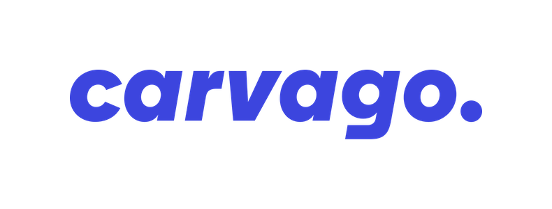

    

## Announcement

This is still a work in progress 👷‍♂️

## Motivation

Our mission at Carvago is not only to deliver exceptional products to others, we also want to establish a great environment inside the company where people can grow professionally and personally.

To support such growth, we implemented this career framework. It defines competencies for specific career tracks, which helps our employees understand where they are in their careers and where they can advance if they choose to.

## How it works

Our career framework is built bottom-up, which means it starts with very specific low-level skills which you can acquire. Having those skills advances you in different [competencies](competencies.md) where you level-up when you acquire new skills. Those competencies and levels reached there determine your overall career [progress](progress.md) within your [career track](career-tracks/readme.md). The career track is quite specific already and together with the progress, it determines your [job grade](grades.md), job title, salary bounds, [compensation](compensation.md) and also responsibilities.

In order to determine all of this and **ensure that everyone progresses forward**, we do [performance reviews](performance-reviews/readme.md) every six months. During a performance review, your manager will hold a general career discussion with you, you will [assess your competencies](performance-reviews/competency-assessment.md) with the manager and talk about your successes, failures and opportunities for improvement. To make sure we dedicate enough attention continuously to your [personal goals](performance-catchups/personal-goals.md), there are also periodic [performance catchups](performance-catchups/readme.md) where your manager will check up on your goals and help you in any way possible to **achieve the goals**. If you complete some of your goals, this is the event where new goals will be established.

## Contents

- [Career Tracks](career-tracks/readme.md)
- [Competencies](competencies.md)
- [Progress](progress.md)
- [Grades](grades.md)
- [Compensation](compensation.md)
- [Calendar](calendar.md)
- [Performance Reviews](performance-reviews/readme.md)
  - [Competency Assessment](performance-reviews/competency-assessment.md)
  - [Performance Review Meeting](performance-reviews/performance-review-meeting.md)
  - [Managers](performance-reviews/managers/readme.md)
    - [Training](performance-reviews/managers/training.md)
    - [Calibration](performance-reviews/managers/calibration.md)
  - [Retrospective](performance-reviews/managers/retrospective.md)
- [Performance Catchups](performance-catchups/readme.md)
  - [Personal Goals](performance-catchups/personal-goals.md)

## Acknowledgement

This package was originally forked from [Mews](https://mews.com), as it was a huge inspiration to us. Thank you!

