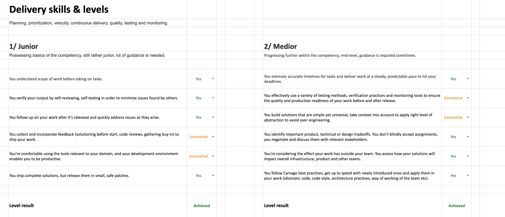

# Score

Score is a number between 0 and 4 that represents your overall progress in your career. It is calculated from the seniority levels you have reached in different competencies. The score is used to determine your job title and salary.

To get your score, you need to evaluate your skills. Skills are organized into seniority leves within competencies. All the skills are part of [assessment template document](https://github.com/Carvago/career-framework/blob/main/assessment-template.xlsx).

## Competencies

We have 4 competencies, in which you can acquire new skills and achieve new levels. The levels achieved in different competencies are used to determine your overall score.

The competency model is designed primarily for engineers, but with a little bit of stretch and interpretation, it is usable for all divisions and roles within technical department.

| Competency       | Description                                                                             |
| ---------------- | --------------------------------------------------------------------------------------- |
| 🚚 Delivery      | Planning, prioritization, performance, quality, testing and monitoring.                 |
| 📚 Know-how      | Knowledge of technologies, patterns, analysis, problem solving, architecture and tools. |
| 💬 Communication | Collaboration with others, documentation, relationships.                                |
| 🎖️ Leadership    | Responsibility, decision making, mentoring, setting an example.                         |

## Levels

Each of the competencies has 4 levels of seniority. The levels are actually **very ambitious**. So to get to senior level is already big achievement. Levels above it require you in many cases to have impact past the standard boundaries of the competency and to affect whole organization or industry.

Do not get discouraged, if you are not advancing every six months. To reach a level, these are the three conditions necessary:

1. You must reach the previous level (you cannot skip levels).
2. There should be no "Nope" skill on the level.
3. You can have two "Somewhat" skills on the level (you must fully demonstrate most of the skills).

| Level    | Description                                                                                                       |
| -------- | ----------------------------------------------------------------------------------------------------------------- |
| 1 Junior | Possessing basics of the competency, lot of guidance is needed.                                                   |
| 2 Medior | Progressing further within the competency, mid-level, guidance is required sometimes.                             |
| 3 Senior | More advanced skills, senior in the role, being able to guide others.                                             |
| 4 Expert | Being able to pass on the knowledge and have impact on other teams or departments. Advancing the company forward. |

## Skills

A competency consists of individual skills that are organized into multiple levels. There are many **skills**. For each skill you should asses whether you posses the skill using the following scores:

- **Nope** - Not at all, meaning that you don't possess the skill.
- **Somewhat** - Having the skill somewhat, but not fully there yet or not showing that consistently.
- **Yes** - Fully possessing the skill, being able to provide multiple examples demonstrating it consistently. Also the skill should be persistent, meaning that you should not stop practicing the skill when you achieve it.

## Score Calculation

In order to determine your score and how far you are in your career track, you take [levels](#levels) of each [competency](#competencies) (number between 0 and 4) and apply weighted average on them. This way, you get to single number, again between 0 and 4, which represents your overall **score**. It can be interpreted as a measure of seniority, with 0 being a novice and 4 being an expert leader.

### Example

As an example, let's consider a standard engineer career track, whose weights might look something like this (this is just an example, the actual weights might differ):

- **30%** 🚚 Delivery
- **55%** 📚 Know-how
- **10%** 💬 Communication
- **5%** 🎖️ Leadership

Now, let's say the person has reached level 3 in delivery and know-how and level 2 in the rest of competencies. That means their overall career progress is **2.85** as per the following calculation:

`3 × 0.30 + 3 × 0.55 + 2 × 0.10 + 2 × 0.05 = 2.85`
